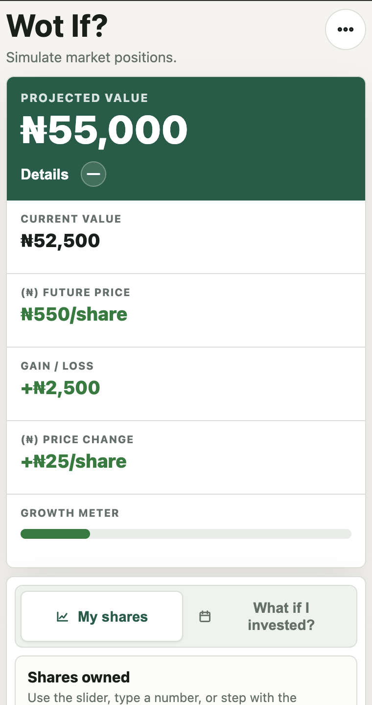

# Wot If?

**Wot If?** na very simple Nigerian share calculator for exploring share value, price movement, and "what if I invested?" scenarios.

## Features

- Share value simulator with sliders, typed inputs, and plus/minus controls
- Naira-based price movement calculations
- Add or remove money at a chosen transaction price
- "What if I invested?" tab for comparing an old buy price with today's price
- Recent calculations saved in local storage
- First-time language picker with Pidgin as the default
- English, Pidgin, Yoruba, Hausa, and Igbo locale support
- Light and dark themes saved in local storage
- Investor education modals for stock, IPO, NGX, and Nigeria SEC
- Web Archive links for extra reading

## Screenshot

## Brand Assets

- `assets/logo.svg` - Wot If? wordmark for profile links, docs, and sharing
- `assets/icon.svg` - app icon and browser favicon
- `assets/social-card.svg` - Open Graph and X/Twitter preview card

For production social previews, use a deployed absolute HTTPS URL for `og:image` and `twitter:image`. Some platforms may prefer a PNG or JPG export of the social card.

## Roadmap
[x] Alpha
[ ] Add 3rd-party API for NGX stocks historical data

## Notes

This project na for education and no be financial advice o.

Copyright 2026 Made with love in Nigeria.
